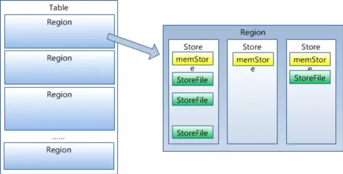

## 存储

### 1. 概览

    

Hbase 主要处理两种文件: 一种是预写日志(Write-Ahead Log,WAL), 另一种是实际的数据文件。

#### 1. HMaster
HMaster 的主要功能有：
1. 把 HRegion 分配到某一个 RegionServer
2. 有 RegionServer 宕机了，HMaster 可以把这台机器上的 Region 迁移到 active 的RegionServer 上
3. 对 HRegionServer 进行负载均衡
4. 通过 HDFS 的 dfs client 接口回收垃圾文件(无效日志等)
注: HMaster 没有单点问题，HBase　中可以启动多个 HMAaster，通过 Zookeeper 的 Master ELection 机制保证总有一个 Master 运行。

#### 2. HRegionServer
1. 维护 HMaster 分配给它的 HRegion，处理对这些 HRegion的 io 请求，也就是说客户端直接和 HRegionServer 打交道.
2. 负责切分正在运行过程中变得过大的 HRegion

### 3.HRegion

每个  ＨRegion 由多个 Store 构成，每个 Store保存一个列族(Colums Family)，表有几个列族，
则有几个 Store，每个 Store 由一个 MemStore 和多个 StoreFile组成，ＭemStore 是 Store 在内存中的内容，
写到文件后就是 StoreFile。StoreFile 底层是以 HFile 的格式保存.

### 4. HLog
HLog(WAL Log): WAL 意为 write ahead log(预写日志)，用来做灾难恢复使用，HLog 记录数据的变更，
包括序列号和实际数据，所以一旦 region server 宕机，就可以从 log 中回滚还没有持久化的数据。

### 5. HFile
HBase 的数据最终是以 HFile 的形式存储在 HDFS 中的，HBase 中 HFile 有着自己的格式。
